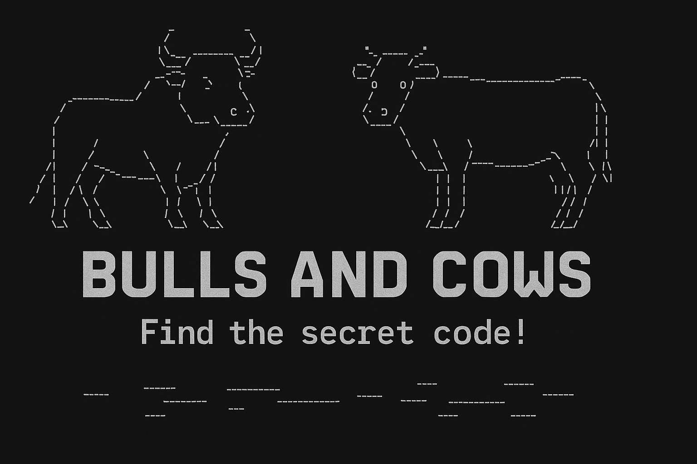

<div align="right">
    
    
    
</div>



## Présentation

**Bulls and Cows – Java Edition** est une version console du célèbre jeu de logique où le but est de deviner un code secret composé de chiffres et/ou de lettres. À chaque tentative, vous recevez des indices : le nombre de **bulls** (caractères bien placés) et de **cows** (caractères corrects mais mal placés).

Préparez votre esprit de déduction, testez vos hypothèses, et trouvez le code en un minimum de tours !

---

## 🎮 Fonctionnalités

* 🔐 Génération aléatoire d’un code secret avec symboles uniques (0–9, a–z)
* 🧪 Indices dynamiques : bulls (bien placés) et cows (mal placés)
* 📊 Suivi du nombre de tours pour mesurer vos performances

---

## 📦 Télécharger et jouer

⭐ Pensez à mettre une étoile au projet si vous l'appréciez !

**➡️ [Télécharger le .jar](https://github.com/ScrimaliAnthony/bullsandcows-java/releases/latest)**

### ▶️ Exécution (Java requis)

```bash
java -jar BullsAndCows.jar
```

Vous serez invité à :

1. Choisir la longueur du code secret
2. Choisir le nombre total de symboles utilisables
3. Deviner jusqu’à trouver le bon code !

💡 Exemple : pour un code de 4 symboles parmi 10 (0–9), tapez : `1234`

---

## 🧱 Structure du projet

```
src/
├── bullscows/
│   ├── Main.java        → Point d'entrée
│   ├── Game.java        → Logique du jeu (code secret, bulls/cows)
│   ├── Player.java      → Saisie des propositions
│   └── Display.java     → Messages et interface console
```

### 🔨 Compilation manuelle

```bash
javac -d out $(find src -name "*.java")
jar cfm BullsAndCows.jar manifest.txt -C out .
```
